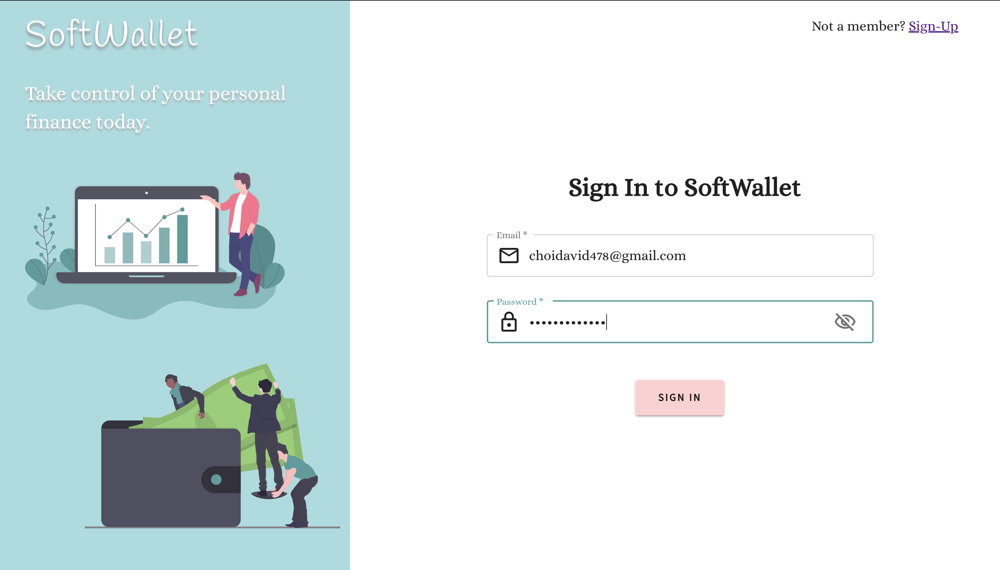
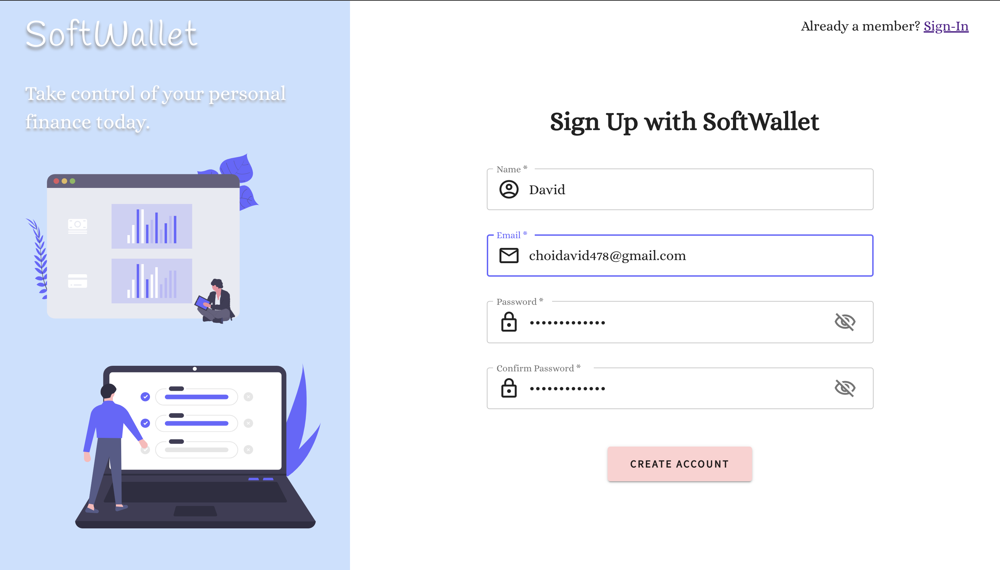
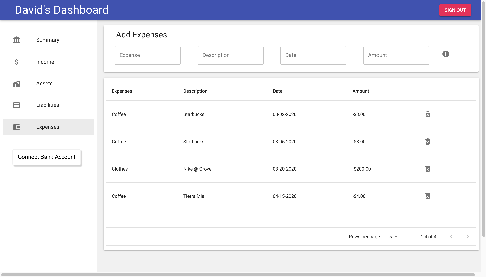
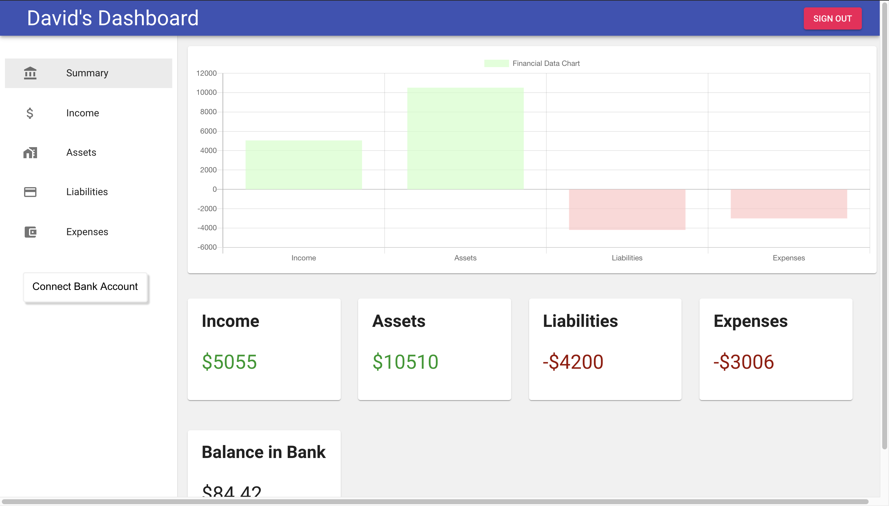

# Soft Wallet
A web application for managing your budget

## Motivation 
  
  I built the full-stack web app for **Soft Wallet** as a personal tool for managing my finances in university.  
  The project is the culmination of my month long journey of learning web development (Javascript, React, Express, PostgreSQL, etc).   

## Technologies/ Frameworks Used

  * **Front-End** :
     * HTML 
     * CSS
     * Javascript
     * React 
     * Material-UI
     * Chart.js 
   * **Back-End** :
     * Node.js
     * Express
     * SQL 
   * **RDBMS** :
     * PostgreSQL
   * **Third-Party API Integration** :
     * Plaid 
  

## Screenshots

 
 

